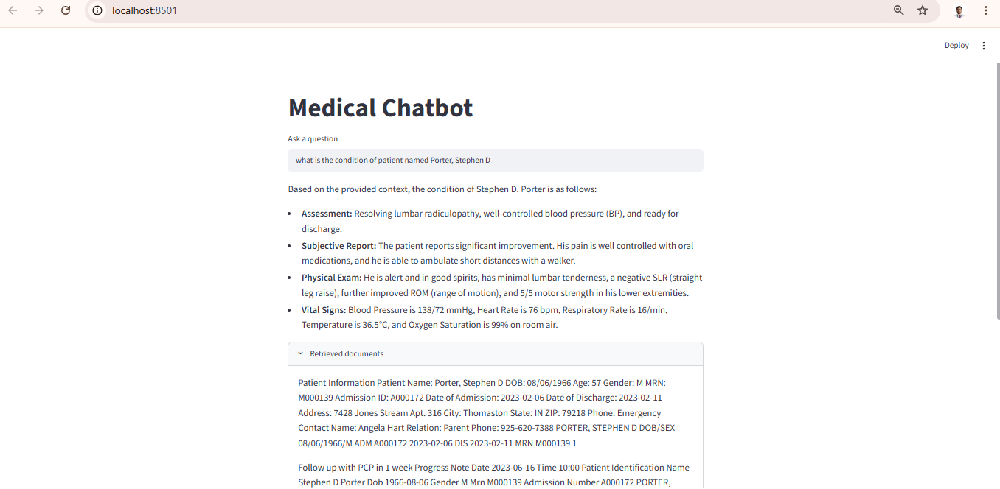

# Medical RAG Chatbot 

# INTERFACE

### create_documents.py

Contains the function to extract the text form pdfs 

### ehr_ingest.py

Contain the following utlity functions
- generate_chunks() convert documents to chunks

- embed_chunks(chunks) embed the chunks using the hugging face embedding model named all-MiniLM-L6-v2

- save_to_chroma() save the embedding to chromaDB

- search_chroma() retrive the relevant documents from chromaDB

### ehr_rag_pipeline.py

Contains the whole RAG pipeline code

### app.py

Contains the streamlit interface code

# TECK STACK

langchain
streamlit
chromadb
google-genai
sentence-transformers
pypdf

